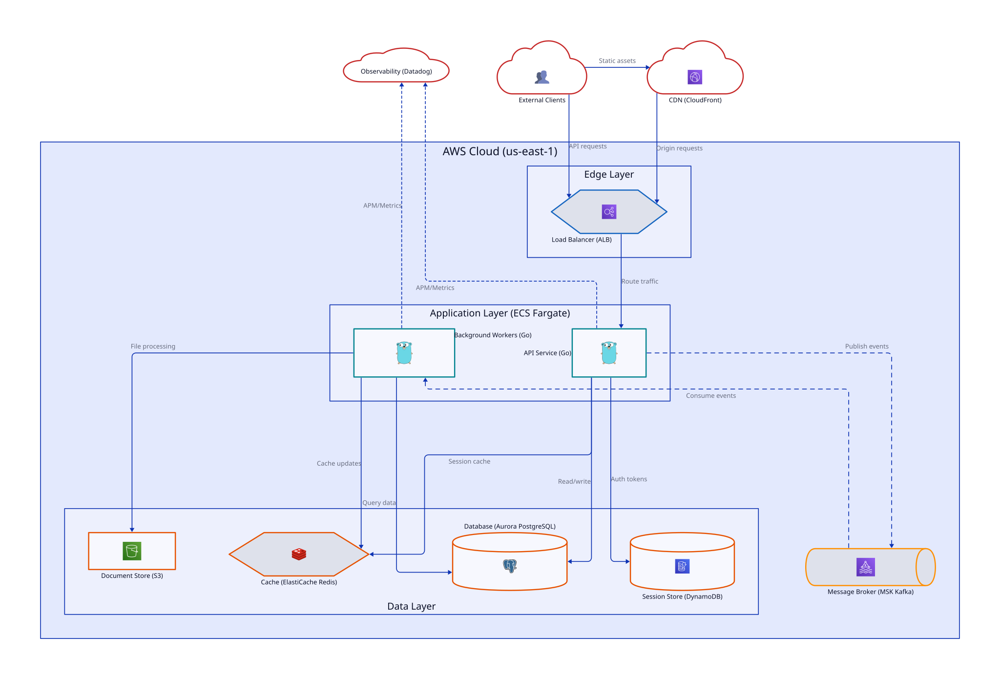
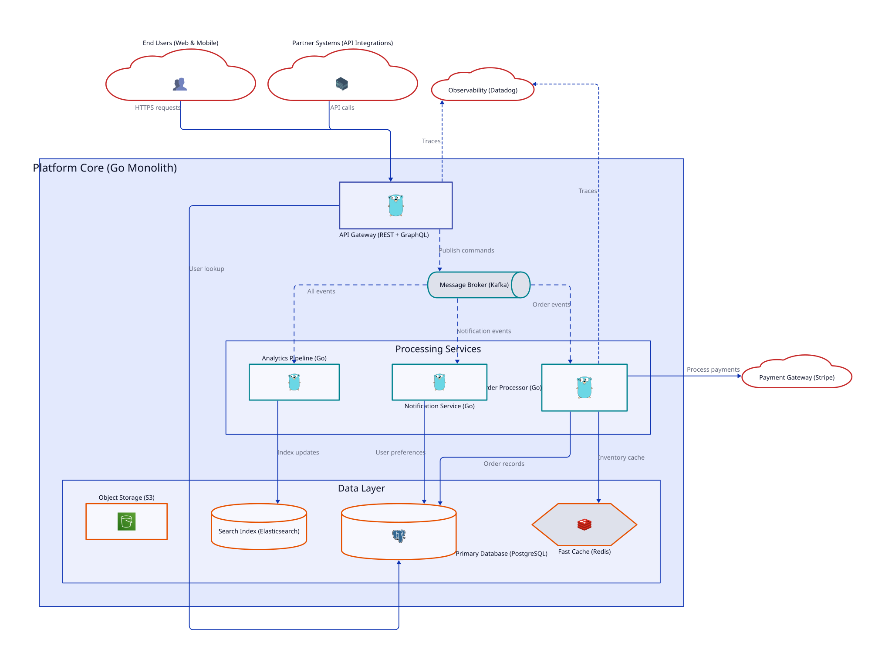

# claude-d2-diagrams

A [Claude Code](https://docs.anthropic.com/en/docs/claude-code) plugin that generates infrastructure and architecture diagrams from your codebase using [D2](https://d2lang.com/).

**Command:** `/d2:diagram`

[](https://opensource.org/licenses/MIT)

---

## Example Output

### Infrastructure
<picture>
  <source media="(prefers-color-scheme: dark)" srcset="./examples/infrastructure-simplified-dark.svg">
  <source media="(prefers-color-scheme: light)" srcset="./examples/infrastructure-simplified-light.svg">
  
</picture>

### Architecture
<picture>
  <source media="(prefers-color-scheme: dark)" srcset="./examples/architecture-simplified-dark.svg">
  <source media="(prefers-color-scheme: light)" srcset="./examples/architecture-simplified-light.svg">
  
</picture>

---

## Features

- Scans Terraform, Kubernetes, Docker, CloudFormation, and code patterns
- 100+ icons (AWS, GCP, Azure, K8s, databases, languages)
- Dark/light theme support
- Animated traffic flow (respects `prefers-reduced-motion`)
- Self-contained SVGs with embedded icons
- D2 syntax validation with auto-fix

---

## Installation

```bash
git clone https://github.com/heathdutton/claude-d2-diagrams.git
claude --plugin-dir ./claude-d2-diagrams
```

**Requires [D2](https://d2lang.com/):**
```bash
brew install d2          # macOS
# or
curl -fsSL https://d2lang.com/install.sh | sh -s --  # Linux
```

---

## Usage

```bash
/d2:diagram                        # Full generation
/d2:diagram --incremental          # Only regenerate changes
/d2:diagram --infrastructure-only  # Skip architecture
/d2:diagram --architecture-only    # Skip infrastructure
/d2:diagram --scope=src/           # Limit scan to directory
```

Creates `./diagrams/` with:
- 4 diagram types (infra, infra-simplified, arch, arch-simplified)
- Each as markdown docs, D2 source, light SVG, dark SVG
- README with all diagrams embedded

---

## Customization

Create `./diagrams/rules.md` to customize:

```markdown
## Naming
- Use "API Gateway" not "APIGW"

## Exclude
- test/
- examples/

## Include (even if not in IaC)
- Cloudflare CDN
- Datadog monitoring
```

---

## License

MIT
